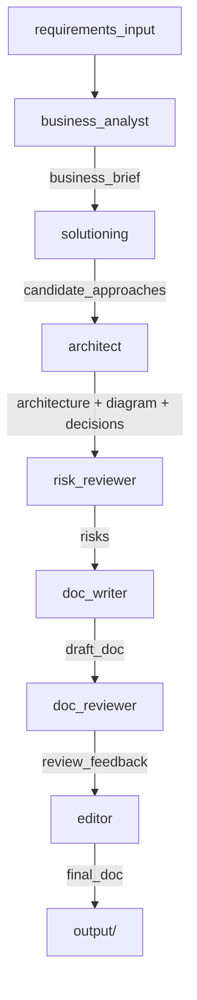

# solution-architect-agents

> A multi-agent system that turns business requirements into a complete solution architecture deliverable.


<!-- Replace examples/screenshot.png with an actual screenshot or demo GIF -->

## What this is

`solution-architect-agents` runs a linear chain of 7 specialised LLM agents (powered by Claude) to transform raw business requirements into a full solution design package: business brief, options analysis, architecture diagram, decision records, risk register, and a polished final document — all in markdown, ready to commit or share.

Built with [LangGraph](https://github.com/langchain-ai/langgraph) and the [Anthropic Python SDK](https://github.com/anthropics/anthropic-sdk-python). Includes a web UI and a CLI. No database, no vector store.

## Quick start

```bash
git clone https://github.com/your-org/solution-architect-agents
cd solution-architect-agents
pip install -r requirements.txt
cp .env.example .env        # add your ANTHROPIC_API_KEY
python main.py --input examples/sample_input.md
```

Output lands in `./output/`. To run on your own requirements:

```bash
python main.py --input path/to/your/requirements.md --output ./output
```

### Web UI

Prefer a browser-based interface with live progress tracking? Start the web server instead:

```bash
uvicorn web.server:app --reload
```

Then open [http://localhost:8000](http://localhost:8000). The UI shows each agent step in real time and supports human-in-the-loop review of the business brief and candidate approaches before the pipeline continues.

## Example output

See [`examples/sample_output/`](examples/sample_output/) for a complete run on the bundled [sample input](examples/sample_input.md) (an internal employee onboarding portal).

The key files:

| File | What it is |
|------|-----------|
| `solution_design.md` | Final polished solution design document |
| `architecture.mmd` | Mermaid diagram source (renders on GitHub) |
| `decisions.md` | Architecture Decision Records (ADR format) |
| `risks.md` | Risk register table |
| `business_brief.md` | Structured brief produced from the raw requirements |
| `options_considered.md` | Full write-up of the architectural options evaluated |
| `review_notes.md` | The doc reviewer's feedback (kept for transparency) |

## How it works



Each agent reads relevant fields from the shared state, calls Claude with a specialised prompt, and writes its outputs back to state. No branching, no loops — a clean linear pipeline.

**Agents:**

| # | Agent | Input | Output |
|---|-------|-------|--------|
| 1 | `business_analyst` | raw requirements | structured business brief |
| 2 | `solutioning` | business brief | 2-3 distinct architectural approaches |
| 3 | `architect` | brief + approaches | chosen approach, architecture description, Mermaid diagram, decisions |
| 4 | `risk_reviewer` | brief + architecture | risk register (5-10 risks) |
| 5 | `doc_writer` | everything above | full draft solution design document |
| 6 | `doc_reviewer` | brief + draft doc | structured critique |
| 7 | `editor` | draft doc + critique | final polished document |

## Customising prompts

All prompts live in `src/prompts/` as plain `.md` files. Edit them directly — no Python required.

```
src/prompts/
├── business_analyst.md
├── solutioning.md
├── architect.md
├── risk_reviewer.md
├── doc_writer.md
├── doc_reviewer.md
└── editor.md
```

Each file defines the agent's role, output format, and constraints. The prompts are the primary lever for improving output quality — better prompts produce better documents.

The model and API key are controlled by environment variables (see `.env.example`):

```
ANTHROPIC_API_KEY=your_key_here
ANTHROPIC_MODEL=claude-opus-4-6
```

## Limitations (v1)

- **Anthropic/Claude only** — no multi-provider support
- **No branching or loops** — if the architect's output is weak, the doc will reflect that; re-run manually
- **No RAG** — agents have no access to your org's existing architecture docs or patterns
- **No PDF/Word export** — markdown output only
- **`output/` is not committed** — intentional; generate your own or use `examples/sample_output/` as a reference

## Roadmap (v2)

- **Requirements validation agent** — pre-flight check that flags ambiguous or incomplete requirements before the pipeline starts
- **Multi-provider LLM support** — OpenAI, Gemini, local models via LiteLLM
- **Human-in-the-loop checkpoints** — pause after the architect and solutioning agents for review before continuing
- **Iterative refinement** — allow the editor to loop back to the doc_writer if the review finds critical gaps
- **PDF/Word export** — via Pandoc
- **RAG over org patterns** — ingest your existing architecture docs to ground the agents' recommendations

## Contributing

**To improve output quality:** edit the prompt files in `src/prompts/`. This is the highest-leverage contribution. If you find a prompt that consistently produces better output, open a PR with before/after examples.

**To add an agent:**
1. Add `src/agents/<name>.py` (follow the pattern in existing agents)
2. Add `src/prompts/<name>.md`
3. Add the new fields to `ArchitectureState` in `src/state.py`
4. Wire the agent into `src/graph.py`
5. Update `src/utils/output_writer.py` if the agent produces a new output file

**To run the tests:**
```bash
pip install pytest pytest-mock
pytest tests/
```

Tests mock the Claude API — no credits consumed.

**PR guidelines:**
- Keep PRs focused — one change per PR
- Include a short description of what changed and why
- If you change a prompt, include example output showing the improvement

## License

MIT
