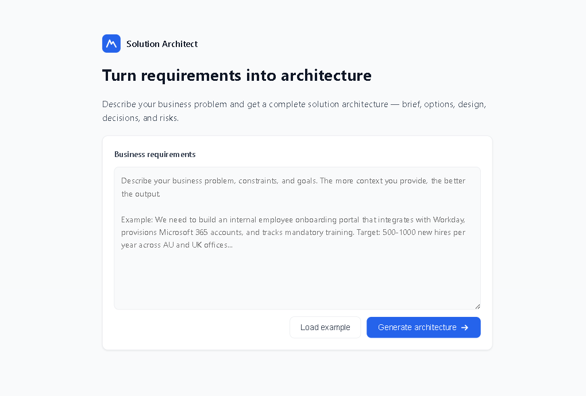
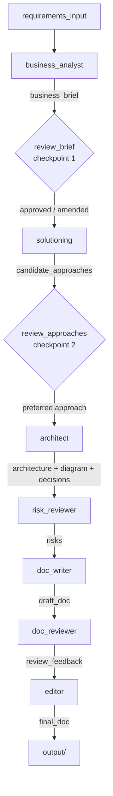

# solution-architect-agents

> A multi-agent system that turns business requirements into a complete solution architecture deliverable.



## Why I built this

I'm a solution architect. I kept finding myself running the same first-pass workflow: read the requirements, draft a brief, sketch out options, write the architecture doc, review it, polish it. This automates that first pass so I can focus on the parts that actually need an architect's brain.

## What this is

`solution-architect-agents` runs a chain of 7 specialised LLM agents (powered by Claude) to transform raw business requirements into a full solution design package: business brief, options analysis, architecture diagram, decision records, risk register, and a polished final document — all in markdown, ready to commit or share.

Built with [LangGraph](https://github.com/langchain-ai/langgraph) and the [Anthropic Python SDK](https://github.com/anthropics/anthropic-sdk-python). Includes a web UI and a CLI. No database, no vector store.

**Cloud and technology agnostic.** The agents follow the requirements you give them. If your brief mentions AWS, the output will be AWS. GCP, on-prem, hybrid — the agents will work with whatever constraints and preferences you specify. The sample output in this repo is Azure because the sample input says "we have an existing Azure tenancy."

## Prerequisites

| Requirement | Version | How to get it |
|-------------|---------|---------------|
| Python | ≥ 3.11 | [python.org/downloads](https://www.python.org/downloads/) — pick the latest 3.11+ installer for your OS |
| Anthropic API key | — | [console.anthropic.com](https://console.anthropic.com) → create an account → API keys → New key |
| pip | bundled with Python | comes with Python; upgrade with `pip install --upgrade pip` if needed |
| venv | bundled with Python | optional but recommended — `python -m venv .venv` then `source .venv/bin/activate` (Windows: `.venv\Scripts\activate`) |

### Python packages (installed automatically)

`pip install -r requirements.txt` installs:

| Package | Purpose |
|---------|---------|
| `anthropic` | Claude API SDK |
| `langgraph` | Agent orchestration graph |
| `pydantic` | State validation |
| `python-dotenv` | Loads `.env` into environment |
| `fastapi` + `uvicorn` | Web UI server |

No Node.js, no Docker, no database required.

## Quick start

```bash
git clone https://github.com/nitintoora/solution-architect-agents
cd solution-architect-agents

# optional but recommended: create an isolated virtual environment
python -m venv .venv
source .venv/bin/activate   # Windows: .venv\Scripts\activate

pip install -r requirements.txt
cp .env.example .env        # add your ANTHROPIC_API_KEY
python main.py --input examples/sample_input.md
```

Output lands in `./output/`. To run on your own requirements:

```bash
python main.py --input path/to/your/requirements.md --output ./output
```

### Web UI

```bash
uvicorn web.server:app --reload
```

Open [http://localhost:8000](http://localhost:8000). The UI shows each agent step in real time and includes human-in-the-loop review points — you can inspect and edit the business brief and candidate approaches before the pipeline continues.

## How it works



Each agent reads from shared state, calls Claude with a specialised prompt, and writes its outputs back. No branching, no loops — a clean linear pipeline with two optional human-in-the-loop checkpoints spliced in.

**Human-in-the-loop checkpoints** are active when you pass `--interactive` on the CLI, or automatically in the web UI. In non-interactive CLI mode they are no-ops and the pipeline runs end-to-end unattended.

| # | Step | Type | What happens |
|---|------|------|--------------|
| 1 | `business_analyst` | agent | Parses raw requirements into a structured business brief |
| — | `review_brief` | **HITL checkpoint** | You can approve the brief or add clarifications; any notes are appended and carried forward |
| 2 | `solutioning` | agent | Generates 2-3 distinct architectural approaches |
| — | `review_approaches` | **HITL checkpoint** | You can pick a preferred approach or press Enter to let the architect decide |
| 3 | `architect` | agent | Designs the chosen approach: architecture description, Mermaid diagram, ADRs |
| 4 | `risk_reviewer` | agent | Produces a risk register (5-10 risks with mitigations) |
| 5 | `doc_writer` | agent | Composes a full draft solution design document |
| 6 | `doc_reviewer` | agent | Produces a structured critique of the draft |
| 7 | `editor` | agent | Polishes the document based on the critique |

## Example output

See [`examples/sample_output/`](examples/sample_output/) for a complete run on the bundled [sample input](examples/sample_input.md) — an internal employee onboarding portal for a company with an existing Azure tenancy. That constraint in the input is why the output is Azure-based.

| File | What it is |
|------|-----------|
| `solution_design.md` | Final polished solution design document |
| `architecture.mmd` | Mermaid diagram source (renders on GitHub) |
| `decisions.md` | Architecture Decision Records (ADR format) |
| `risks.md` | Risk register table |
| `business_brief.md` | Structured brief produced from the raw requirements |
| `options_considered.md` | Full write-up of the architectural options evaluated |
| `review_notes.md` | The doc reviewer's feedback (kept for transparency) |

## Customising prompts

All prompts live in `src/prompts/` as plain `.md` files. Edit them directly — no Python required.

```
src/prompts/
├── business_analyst.md
├── solutioning.md
├── architect.md
├── risk_reviewer.md
├── doc_writer.md
├── doc_reviewer.md
└── editor.md
```

Each file defines the agent's role, output format, and constraints. The prompts are the primary lever for improving output quality — better prompts produce better documents.

The model and API key are set via environment variables (see `.env.example`):

```
ANTHROPIC_API_KEY=your_key_here
ANTHROPIC_MODEL=claude-opus-4-6
```

## Limitations

- **Anthropic/Claude only** — no multi-provider support yet
- **No branching or loops** — if the architect's output is weak, the doc will reflect that; re-run manually
- **No RAG** — agents have no access to your org's existing architecture docs or patterns
- **No PDF/Word export** — markdown output only
- **`output/` is not committed** — intentional; generate your own or use `examples/sample_output/` as a reference

## Roadmap

- **Requirements validation agent** — pre-flight check that flags ambiguous or incomplete requirements before the pipeline starts
- **Multi-provider LLM support** — OpenAI, Gemini, local models via LiteLLM
- **Iterative refinement** — allow the editor to loop back to the doc_writer if the review finds critical gaps
- **PDF/Word export** — via Pandoc
- **RAG over org patterns** — ingest your existing architecture docs to ground the agents' recommendations

## Contributing

**To improve output quality:** edit the prompt files in `src/prompts/`. This is the highest-leverage contribution. If you find a prompt that consistently produces better output, open a PR with before/after examples.

**To add an agent:**
1. Add `src/agents/<name>.py` (follow the pattern in existing agents)
2. Add `src/prompts/<name>.md`
3. Add the new fields to `ArchitectureState` in `src/state.py`
4. Wire the agent into `src/graph.py`
5. Update `src/utils/output_writer.py` if the agent produces a new output file

**To run the tests:**
```bash
pip install pytest pytest-mock
pytest tests/
```

Tests mock the Claude API — no credits consumed. Keep PRs focused and include a short description of what changed and why. If you change a prompt, include example output showing the improvement.

## License

MIT
