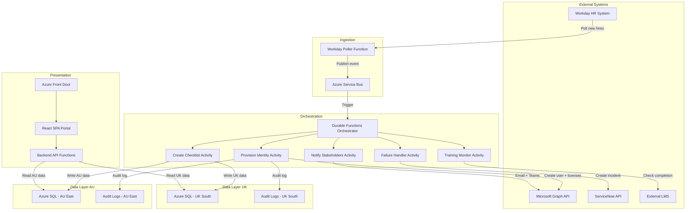

## Context and drivers

Employee onboarding at the organisation currently takes 3–5 days and depends on manual coordination across HR, IT, and hiring managers. When a new hire starts, HR initiates the process in Workday, IT manually provisions accounts in Microsoft 365 and Entra ID, and hiring managers track onboarding tasks through informal channels. This creates a compounding delay: new hires cannot be productive until accounts are provisioned and onboarding tasks are completed, while a small engineering team of three people absorbs repetitive operational work that pulls them away from higher-value activities.

The business needs an internal onboarding portal that automates account provisioning, centralises the onboarding checklist for new hires, and gives hiring managers real-time visibility into onboarding progress. The target is to reduce standard-role onboarding to same-day completion. The solution must also satisfy a hard compliance requirement: Australian employee data must be stored and processed in Australia, and UK employee data must be stored and processed in the UK.

The driver for acting now is the combination of operational burden on a capacity-constrained team and the compliance exposure inherent in a manual, loosely tracked process. Without an automated, auditable system, provisioning actions are not consistently logged, failures are not systematically escalated, and data residency compliance depends on individual engineers following manual procedures correctly. The organisation onboards 500–1,000 new hires per year across two regions, which is sufficient volume to justify automation but modest enough that the solution must favour managed services over complex, self-hosted infrastructure.

## Current state

Onboarding is initiated in Workday by the HR team and then coordinated manually. IT engineers receive requests (likely via email or internal ticketing) to provision user accounts in Entra ID and assign Microsoft 365 licenses. Hiring managers track role-specific onboarding tasks informally — there is no centralised checklist or dashboard. Provisioning failures are detected and resolved ad hoc, with no automated escalation to ServiceNow. Audit logging of provisioning actions is inconsistent or absent. Training completion is tracked separately, and there is no single view for a new hire to see all outstanding onboarding tasks. The entire process takes 3–5 business days for a standard role.

## Options considered

| Option | Summary | Suitability | Selected? |
|--------|---------|-------------|-----------|
| **Event-Driven Azure Functions Pipeline** | Serverless, event-driven chain of Azure Functions triggered via Service Bus, with Cosmos DB for multi-region data storage and a React SPA on Static Web Apps. Each provisioning step is an independent function linked by messages. | Good serverless fit for a small team with near-zero infrastructure overhead. However, debugging distributed function chains is harder without explicit workflow state, and Cosmos DB is expensive relative to the modest data volume. Loose coupling benefits do not justify the observability cost at this scale. | No |
| **Durable Functions Orchestrator with Regional Deployments** | Models the full onboarding workflow as a single stateful Durable Functions orchestration per new hire. Two fully independent regional deployments (AU and UK) with separate Function Apps, databases, and pipelines enforce strict data residency. | Excellent workflow visibility and failure handling. However, two fully independent stacks double CI/CD pipelines, monitoring, and schema migration effort — over-engineering the separation for 500–1,000 hires/year and too heavy for a 3-engineer team. | No (informed the selected approach) |
| **Low-Code Power Platform with Azure Backend** | Power Apps for the portal UI, Power Automate for workflow orchestration with pre-built Workday, Graph, and ServiceNow connectors. Azure SQL and Functions used only where Power Platform cannot meet requirements. | Fastest time-to-value and lowest custom code. However, data residency control within Dataverse is uncertain without complex environment splitting. Premium connector licensing adds recurring cost. Complex provisioning logic forces escape hatches into Azure Functions, creating a harder-to-maintain hybrid. | No |
| **Durable Functions Orchestrator with Shared Infrastructure and Regional Data Isolation** (synthesised) | Per-region Function Apps for stateful orchestration with Durable Functions, with regional data isolation enforced at the storage layer (separate Azure SQL databases, blob storage, and task hubs per region). Shared infrastructure (Service Bus, Static Web Apps, Front Door) deployed once. React SPA on Static Web Apps for the portal. | Combines workflow visibility and built-in retry/failure handling of Durable Functions with roughly half the infrastructure management burden of full dual-region deployments. Regional data isolation is enforced where data is persisted and where orchestration state is stored, not by duplicating the entire infrastructure stack. Appropriate for a 3-engineer team at this scale. | **Yes** |

## Proposed architecture

The system is structured as four layers: an ingestion layer that receives new hire events from Workday, an orchestration layer that executes the multi-step onboarding workflow via per-region Function Apps, a data layer with strict regional isolation for AU and UK, and a presentation layer serving the portal to new hires, managers, and HR/IT staff. The design uses Azure PaaS services throughout to minimise operational overhead for the three-engineer team. Data residency is enforced at the storage layer and the orchestration layer — each region has its own Function App, Durable Functions task hub, SQL database, and blob storage — while shared components that do not persist employee data (Service Bus, Front Door, Static Web Apps) are deployed once.

**Note on the diagram:** The diagram shows a simplified logical view. In the physical deployment, the Orchestration subgraph is deployed as two separate Azure Function Apps — one in AU East and one in UK South — each with its own Durable Functions task hub. The Service Bus uses topic subscriptions with region filters to route each new hire event to the correct regional Function App. This ensures orchestration state (which may contain employee identifiers) never leaves the employee's region. See the Orchestration Layer section and Key Decision "Single compute deployment with regional data isolation" for details.

### Ingestion Layer

A timer-triggered Azure Function polls the Workday REST API every 15 minutes for new hire records flagged for onboarding. When a new hire is detected, the function publishes a message to an Azure Service Bus topic. Each message includes the employee's region (AU or UK) as a message property, which Service Bus topic subscriptions use to route the message to the correct regional subscription. Service Bus provides reliable, at-least-once delivery and decouples the Workday polling cadence from the orchestration processing rate. A cursor-based checkpoint stored in Azure Table Storage ensures the poller resumes from the correct position across invocations, preventing missed or duplicate records.

If Workday later supports webhooks or push notifications, the polling function can be replaced with an HTTP-triggered function without any changes to downstream components — the Service Bus topic acts as the stable interface between ingestion and orchestration.

### Orchestration Layer

Each regional Service Bus subscription triggers a new Durable Functions orchestration instance in the corresponding regional Function App (AU East or UK South). The orchestrator models the onboarding workflow as an explicit sequence of activity functions:

1. **Provision Identity** — Calls the Microsoft Graph API to create the user in Entra ID and assign M365 licenses appropriate to the new hire's role. Implements exponential backoff with jitter for Graph API throttling (429 responses).
2. **Verify Provisioning** — Polls Graph API to confirm the account is active and licensed, with a configurable timeout (default 10 minutes, 30-second polling intervals) to account for Entra ID replication delays.
3. **Create Onboarding Checklist** — Writes the new hire's personalised checklist to the regional Azure SQL database. The checklist includes role-specific tasks, mandatory training modules, and document acknowledgements.
4. **Send First-Login Credentials** — Generates a Temporary Access Pass (TAP) via the Graph API and sends an email to the new hire's personal email address (sourced from the Workday record) containing the TAP, their new corporate email address, and a link to the onboarding portal. The TAP allows the new hire to authenticate to Entra ID and set up their credentials (password and MFA) without requiring prior access to corporate email or Teams. The TAP has a configurable lifetime (default: 24 hours, single-use).
5. **Notify Stakeholders** — Sends notifications to the hiring manager via email or Microsoft Teams message using Graph API, confirming the new hire's account is provisioned and onboarding has begun.
6. **Monitor Training Completion** — Uses a Durable Functions timer-based sub-orchestration to periodically check the external LMS for training completion status and update the checklist record in the regional database.

**Non-standard role handling:** The orchestrator inspects a role-type attribute from the Workday record to determine whether the new hire is a standard or non-standard role. For non-standard roles (e.g., roles requiring elevated access, specialised software, or hardware provisioning), the orchestrator executes steps 1–5 above (basic identity provisioning, checklist creation, and credential delivery) but marks the checklist with additional manual tasks and creates a ServiceNow ticket assigned to the relevant IT or security team. The orchestration then enters a waiting state using a Durable Functions external event, and resumes when IT signals completion via an HTTP API call. This ensures non-standard roles still benefit from automated identity provisioning and checklist tracking while accommodating the manual steps that cannot yet be automated.

If any provisioning step fails after configured retries, the orchestrator invokes a failure-handling activity that creates a ServiceNow incident via REST API and pauses the orchestration. The orchestration can be resumed via an HTTP API call once the issue is resolved by IT, enabling a clean handoff between automated and manual resolution paths.

To enforce data residency for orchestration state itself, the Service Bus uses topic filters based on the employee's region property to route messages to region-specific subscriptions. Each region has its own Azure Functions app with its own Durable Functions task hub backed by storage in the corresponding region (AU East or UK South). This ensures that orchestration instance history — which may contain employee identifiers in activity inputs and outputs — never leaves the employee's region.

### Data Layer — Regional Isolation

Two Azure SQL Database instances serve as the primary data stores: one in AU East and one in UK South. They store identical schemas covering employee onboarding records, checklist items, provisioning status, and training completion. A thin data-access layer in the API inspects the employee's region attribute and routes all queries to the correct regional database. No cross-region queries or joins are permitted by the application layer.

Immutable audit logs are written to Azure Append Blob Storage in the corresponding region. Every provisioning action — attempt, success, failure, and retry — is logged as a structured JSON record with a timestamp, actor, action, and outcome. Azure immutability policies (WORM) with time-based retention (period to be confirmed with compliance) ensure logs cannot be modified or deleted. Lifecycle management policies transition logs to Cool and then Archive storage tiers after 12 months to manage long-term costs.

The region attribute is treated as a mandatory non-null field at the ingestion layer. Any Workday record missing a valid region value is rejected and generates an alert. The API layer implements a fail-closed policy: if the region claim is absent or unrecognised in an authenticated request, the request is denied rather than defaulted to either region.

### Presentation Layer

A React single-page application hosted on Azure Static Web Apps serves as the onboarding portal. It authenticates users via Entra ID using MSAL.js, providing SSO consistent with the organisation's existing identity infrastructure. Azure Front Door provides global load balancing, SSL termination, and geographic routing so that UK users are served with minimal latency.

The backend API is implemented as HTTP-triggered Azure Functions deployed in both AU East and UK South behind Azure Front Door with geographic routing. The API determines the user's role from Entra ID group claims and serves the appropriate view:

- **New hires** see their personalised onboarding checklist with task status, links to training modules, and document acknowledgements.
- **Hiring managers** see a dashboard of their direct reports' onboarding progress, with real-time status for each step. Hiring managers only see new hires within their own region (see Assumptions). If cross-region management is required in the future, the API layer can issue parallel queries to both regional databases and aggregate results at the API layer without any cross-region data transfer at the database level.
- **HR and IT staff** see aggregate views across all onboarding workflows. For initial delivery, audit log access is provided via direct Azure Portal access to the regional blob storage accounts, scoped by RBAC. A structured audit log viewer within the portal is planned for a subsequent phase (see Open Questions).

The API enforces data residency by routing to the correct regional database based on the authenticated user's region attribute from their Entra ID profile.

### Integration Points

| System | Direction | Mechanism | Purpose |
|--------|-----------|-----------|---------|
| **Workday** | Inbound (poll) | REST API, polled every 15 minutes | Source of new hire records; triggers onboarding workflow |
| **Microsoft Graph API** | Outbound | REST API (OAuth 2.0 client credentials) | Entra ID user creation, M365 license assignment, Temporary Access Pass generation, Teams/email notifications |
| **ServiceNow** | Outbound | REST API | Automated incident ticket creation on provisioning failures and non-standard role handoffs |
| **External LMS** | Inbound (poll or webhook) | REST API (mechanism TBC) | Training completion status tracking |
| **Entra ID** | Bidirectional | MSAL.js (frontend), Graph API (backend) | User authentication (SSO), identity provisioning |

### Data Flows

1. **New hire ingestion:** Workday → Poller Function → Service Bus topic → (routed by region filter) → Regional Durable Functions Orchestrator (AU East or UK South).
2. **Account provisioning:** Regional Orchestrator → Provision Identity Activity → Graph API → Entra ID / M365. Audit log written to regional Append Blob Storage.
3. **First-login credential delivery:** Regional Orchestrator → Send First-Login Credentials Activity → Graph API (generate TAP) → Email to new hire's personal address (from Workday record).
4. **Checklist creation:** Regional Orchestrator → Create Checklist Activity → Regional Azure SQL Database.
5. **Failure escalation:** Regional Orchestrator → Failure Handler Activity → Service Bus (ServiceNow queue) → ServiceNow consumer function → ServiceNow REST API.
6. **Non-standard role handoff:** Regional Orchestrator → Create ServiceNow Ticket → Pause orchestration → Resume via HTTP API call from IT.
7. **Training tracking:** Regional Orchestrator → Training Monitor Activity → External LMS API → Regional Azure SQL Database (update checklist).
8. **Portal reads:** React SPA → Azure Front Door → Regional Backend API Function → Regional Azure SQL Database (routed by user's region claim).
9. **Notifications:** Regional Orchestrator → Notify Activity → Graph API → Email / Teams message to hiring manager.

### Indicative Cost Estimate

The following estimates are monthly run-rate ranges based on Azure list pricing for the expected scale (500–1,000 new hires/year, ~2–4 per business day). Actual costs will vary based on usage patterns and any existing enterprise agreements.

| Component | Configuration | Estimated Monthly Cost |
|-----------|--------------|----------------------|
| Azure SQL Database × 2 regions | Basic/S0 tier, ~5 DTUs each | $30–$100 |
| Azure Functions × 2 regions (orchestration) | Consumption plan (Premium if R1 timeout requires it: +$100–$150/region) | $0–$50 (Consumption) or $200–$350 (Premium) |
| Azure Functions (API) × 2 regions | Consumption plan | $0–$20 |
| Azure Service Bus | Standard tier, single namespace | $10–$15 |
| Azure Static Web Apps | Standard tier | $10 |
| Azure Front Door | Standard tier | $35–$50 |
| Azure Blob Storage × 2 regions | Hot + lifecycle to Cool/Archive | $5–$10 |
| Azure Table Storage | Poller checkpoint | <$1 |
| **Total (Consumption plan)** | | **$90–$250/month** |
| **Total (Premium plan for Functions)** | | **$290–$600/month** |

These estimates exclude Microsoft 365 licensing (assumed existing), Workday licensing, ServiceNow licensing, and any LMS costs. The Premium plan range is included because Risk R1 identifies it as a potential mitigation — the decision can be deferred until polling duration is measured in development.

## Key decisions

**Single compute deployment with regional data isolation**

- **Context:** Data residency requires AU data in AU and UK data in UK. The team has only 3 engineers, making dual full-stack deployments expensive to maintain. However, Durable Functions task hub state may contain employee identifiers, creating a secondary residency concern beyond just the database layer.
- **Decision:** Deploy per-region Azure Function Apps for orchestration (each with its own Durable Functions task hub backed by in-region storage), with regional data isolation also enforced at the database and blob storage layers. Shared infrastructure (Static Web Apps, Front Door, Service Bus namespace) is deployed once.
- **Reasoning:** This approach gives equivalent data residency guarantees at the persistence and orchestration state layers without fully doubling the entire infrastructure stack. Orchestration state is kept in-region by routing Service Bus messages to region-specific function apps. Shared components like Front Door and the ingestion poller do not persist employee data and are safe to run from a single location. The result is roughly half the infrastructure management burden of two fully independent stacks while maintaining compliance.
- **Alternatives considered:** Fully independent regional stacks with separate Function Apps, databases, and CI/CD pipelines per region; single global database with row-level region tagging (rejected as it violates data residency).

**Durable Functions for workflow orchestration**

- **Context:** Onboarding is a multi-step, stateful workflow with dependencies between steps, retry requirements, and the need for failure escalation to ServiceNow. The team needs to debug production issues quickly with minimal operational overhead.
- **Decision:** Use Azure Durable Functions to model each new hire's onboarding as a single orchestration instance with explicit activity functions for each step.
- **Reasoning:** Durable Functions provide built-in state management, configurable retry policies, timeout handling, and human-interaction patterns. Each orchestration instance is independently inspectable — showing exactly which step succeeded, which failed, and how many retries have been attempted. This is substantially easier to debug than correlating events across a chain of independent functions and message queues. The learning curve for Durable Functions is justified by the operational benefits for a small team maintaining a production system.
- **Alternatives considered:** Loosely coupled Azure Functions chained via Service Bus topics (good decoupling but harder to debug); Power Automate workflows with premium connectors (data residency uncertainty, licensing cost); Azure Logic Apps with built-in connectors (higher per-execution cost, less code-level control).

**Azure SQL Database over Cosmos DB**

- **Context:** The data model is relational — employees have checklists, checklists have tasks, tasks have completion records, and managers need dashboard queries that join across these entities. Scale is modest at 500–1,000 new hires per year.
- **Decision:** Use Azure SQL Database (one instance per region) as the primary data store.
- **Reasoning:** Azure SQL is significantly cheaper than Cosmos DB at this scale (estimated under $50/month per regional instance versus hundreds for Cosmos DB). The data is naturally relational and benefits from foreign keys and joins for manager dashboard queries. Cosmos DB's multi-region write capability is elegant but overkill for this volume and introduces eventual consistency patterns the team does not need. Azure SQL is a well-understood technology that reduces the learning surface for the team.
- **Alternatives considered:** Azure Cosmos DB with multi-region write and geo-fencing; Dataverse (Power Platform); Azure Table Storage (insufficient query capability for dashboard views).

**Workday polling over webhook-driven ingestion**

- **Context:** Workday must trigger the onboarding workflow. Workday supports REST APIs for polling, but webhook availability and reliability varies by tenant configuration and requires Workday-side setup.
- **Decision:** Start with a timer-triggered Azure Function polling Workday's REST API every 15 minutes. The architecture is designed so that switching to webhook-triggered ingestion later requires changing only the ingestion function, with no downstream impact.
- **Reasoning:** Polling is simpler to implement, test, and debug — the team controls the cadence and can inspect results directly. The Service Bus queue decouples ingestion from orchestration, making the ingestion mechanism swappable. For 2–4 new hires per business day, 15-minute polling latency is acceptable and still enables same-day onboarding comfortably. Webhook integration can be added as an optimisation once the core system is stable and Workday tenant configuration is confirmed.
- **Alternatives considered:** Workday webhook to HTTP-triggered Function; Workday Integration Cloud connector to Service Bus; Azure Data Factory Workday connector.

**Immutable Append Blob Storage for audit logs**

- **Context:** All provisioning actions must be captured in an immutable audit log for compliance. The required retention period needs clarification but must support extended retention without risk of log tampering.
- **Decision:** Write audit logs to Azure Append Blob Storage in each region with WORM immutability policies and time-based retention.
- **Reasoning:** Append Blobs are purpose-built for append-only workloads. Azure's immutability policies ensure logs cannot be modified or deleted within the retention window, satisfying compliance requirements without additional application-level hardening. Cost is negligible at this volume. Logs can be queried via Azure Data Explorer or exported to Log Analytics if richer querying is needed later. This is simpler and more tamper-resistant than database-based audit tables, which require triggers and stored procedure restrictions to prevent modification.
- **Alternatives considered:** Azure SQL audit tables with modification-prevention triggers; Azure Monitor / Log Analytics workspace (limited retention control); dedicated audit database with append-only stored procedures.

**React SPA on Azure Static Web Apps for the portal**

- **Context:** New hires, managers, and HR need a web portal for checklist management and status visibility. The team is small and needs to minimise frontend infrastructure management.
- **Decision:** Build a React single-page application hosted on Azure Static Web Apps, authenticated via Entra ID using MSAL.js, with Azure Front Door providing global load balancing.
- **Reasoning:** Azure Static Web Apps provides built-in Entra ID authentication integration, global CDN, automatic SSL, and CI/CD from GitHub — eliminating frontend infrastructure management entirely. React is widely adopted and straightforward to hire for if the team grows. A responsive web application satisfies both desktop and mobile access without the cost and complexity of a native mobile app. The backend API functions can be linked via Static Web Apps' managed API feature, simplifying CORS and deployment.
- **Alternatives considered:** Power Apps model-driven app (data residency uncertainty); Blazor WebAssembly on Azure App Service (smaller talent pool); server-rendered ASP.NET Core MVC on App Service (unnecessary server management overhead).

## Risks and mitigations

| ID | Risk | Likelihood | Impact | Mitigation |
|----|------|------------|--------|------------|
| R1 | Workday poller times out or misses records during bulk hiring events (e.g., start of month) due to API slowness, rate limiting, or large paginated result sets, leading to delayed or dropped onboarding initiations. | Medium | High | Implement cursor-based pagination with a durable checkpoint in Azure Table Storage so the poller resumes across invocations. Use Azure Functions Premium plan if the 10-minute Consumption plan timeout is insufficient (see cost estimate for impact). Add dead-letter alerting: if a poll cycle fails, the next cycle detects the gap via the checkpoint and reprocesses. Monitor every poll cycle's record count and duration. |
| R2 | Durable Functions task hub state for UK employees stored in AU region, violating data residency. A single function app binds to a single task hub in a single storage account, making it unclear how one function app routes orchestration instances to different regional task hubs. Cross-region latency on every orchestration checkpoint is also a concern. | High | High | Deploy a separate Azure Functions app in UK South with its own Durable Functions task hub backed by UK storage. Use Service Bus topic filters on the employee's region property to route messages to region-specific subscriptions, each triggering the corresponding regional function app. This ensures orchestration state never leaves the employee's region and eliminates cross-region checkpoint latency. |
| R3 | Region attribute missing or incorrectly set in Workday, or not propagated to Entra ID token at first login, causing data to be routed to the wrong regional database and violating the hard data residency compliance requirement. | Medium | High | Enforce region as a mandatory non-null field at the ingestion layer — reject any Workday record missing a valid region and raise an alert. Implement a fail-closed policy in the API layer: if the region claim is absent or unrecognised, deny the request rather than defaulting. Add integration tests that assert cross-region data leakage is impossible by querying each database for records belonging to the other region. |
| R4 | Microsoft Graph API throttling (429 responses) and Entra ID replication delays cause cascading retries during bulk onboarding events, delaying provisioning and potentially breaching the same-day SLA. | Medium | Medium | Implement exponential backoff with jitter on Graph API calls, respecting the Retry-After header. Rate-limit outbound Graph calls using a semaphore pattern in the orchestrator (e.g., limit to 5 concurrent provisioning activities). Set verification polling timeout to 10 minutes with 30-second intervals. For bulk events, process orchestrations sequentially or in small batches rather than all concurrently. |
| R5 | ServiceNow unreachable at the moment of a provisioning failure, causing the incident ticket to not be created and leaving the operations team with no visibility into blocked onboarding. | Medium | Medium | Route ServiceNow ticket creation through a dedicated Service Bus queue with a separate consumer function, providing built-in retry with dead-letter queue support. Configure DLQ alerts via Azure Monitor so that if ticket creation fails after retries, IT service desk is notified via an independent channel (email alert from Azure Monitor Action Group). |
| R6 | External LMS integration is fragile or infeasible because the LMS platform, API capabilities, authentication model, and reliability characteristics are unspecified. Could become the most maintenance-intensive component. | High | Medium | Prioritise LMS API discovery immediately — confirm vendor, available endpoints, authentication model, rate limits, and webhook support before committing to the polling design. If the LMS supports webhooks, use event-driven ingestion instead. If the API is unreliable or nonexistent, fall back to manual completion marking in the portal by HR, with automation as a future backlog item. Define this integration as a separate delivery milestone. |
| R7 | Loss of one engineer (illness, departure) removes 33% of team capacity with no redundancy, risking delivery delays and knowledge silos across four external system integrations, orchestration engine, frontend, CI/CD, and IaC. | Medium | High | Phase delivery: ship Workday ingestion + Graph provisioning + ServiceNow ticketing as MVP (core value), then add portal frontend and LMS integration in a second phase. Enforce pair programming or thorough PR reviews on all integration code to prevent knowledge silos. Document all external API contracts, authentication setup, and retry configurations in a runbook. Identify one engineer from an adjacent team who can provide emergency support. |
| R8 | UK portal users experience cross-region API latency (~200ms+) if the backend API runs only in AU East, degrading user experience for UK-based hiring managers and new hires. | Low | Medium | Deploy HTTP-triggered API functions in both AU East and UK South behind Azure Front Door with geographic routing, so UK users hit UK compute. Alternatively, use Azure Static Web Apps' built-in managed Functions backend to simplify deployment. If single-region API is retained, document the latency impact and validate it is acceptable with UK stakeholders. |
| R9 | Immutable audit log retention period is unconfirmed. If later set to 7+ years, storage costs grow and legal hold policies may conflict with GDPR Article 17 (right to erasure) for UK employee data. | Medium | Medium | Resolve retention period with compliance stakeholder before implementation (see Open Questions). Obtain legal counsel confirmation on whether employment compliance obligations override GDPR erasure requests for audit records (they typically do, but must be documented). Use time-based retention policies (not indefinite legal holds) aligned to the confirmed period. Implement lifecycle management to transition logs to Cool/Archive tier after 12 months. |
| R10 | Durable Functions orchestration instance history accumulates indefinitely and may contain PII (employee names, roles) in activity input/output payloads, creating an uncontrolled data store that could violate data residency or retention policies. | Medium | Medium | Schedule a nightly cleanup function using the Durable Functions purge instance history API to remove completed orchestration instances older than 30 days (or the agreed retention window). Minimise PII in activity function inputs/outputs by passing employee IDs rather than full records, with activities looking up details from the regional SQL database at execution time. Ensure task hub storage accounts are in the correct region and are included in data residency documentation. |

## Assumptions

- Workday is the authoritative source for new hire data and will trigger or supply the data that initiates the onboarding workflow (e.g., via API or event).
- "Standard roles" (eligible for same-day provisioning) represent the majority of new hires; non-standard roles receive automated identity provisioning and checklist creation but may require additional manual steps coordinated via ServiceNow (see Orchestration Layer).
- The existing Entra ID tenant is already federated or connected to Microsoft 365, so provisioning an identity in Entra ID grants access to M365 services.
- The Entra ID tenant supports Temporary Access Pass (TAP) policy, which is required for the first-login credential delivery flow.
- Mandatory training modules are already defined and hosted externally; the portal needs to track completion status rather than host training content itself.
- The portal will authenticate users via Entra ID (SSO), consistent with existing identity infrastructure.
- ServiceNow has an available API or integration pathway (e.g., REST API) for automated ticket creation.
- "In-region" data residency applies to the onboarding portal's data storage and processing, not to Workday or M365 themselves (which have their own residency configurations).
- The two regions (AU and UK) cover all employees; there are no other office locations to support.
- Hiring managers only manage new hires within their own region. If cross-region management is required, the API can issue parallel queries to both regional databases (see Presentation Layer).
- There is no requirement for the portal to handle employee offboarding or role changes — only initial onboarding.
- Workday records include the new hire's personal email address, which is used to deliver first-login credentials before their corporate account is accessible.

## Open questions

The following items require resolution before or during implementation. Each is linked to the design decisions or risks it affects.

| ID | Question | Affects | Suggested Owner | Proposed Deadline |
|----|----------|---------|----------------|-------------------|
| OQ1 | Where are mandatory training modules hosted — an existing LMS, SharePoint, or a third-party platform? What API does the platform expose? | Orchestration Layer (Training Monitor Activity), Risk R6, delivery phasing | HR / IT Lead | Before development sprint 1 |
| OQ2 | Are there any employees outside AU and UK, or plans to expand to other regions within 12 months? | Data Layer schema, Service Bus routing, regional Function App deployment | HR Lead | Before architecture finalisation |
| OQ3 | Are there other SaaS applications that need provisioning beyond M365 (e.g., Slack, Salesforce, domain-specific tools)? | Orchestration Layer (additional provisioning activities), scope | IT Lead / Hiring Managers | Before development sprint 1 |
| OQ4 | Is a responsive web portal acceptable for mobile access, or is a native mobile app required? | Presentation Layer technology choice | Project Sponsor | Before architecture finalisation |
| OQ5 | What is the required audit log retention period? Does GDPR right-to-erasure apply to provisioning audit records for UK employees? | Risk R9, WORM policy configuration, storage cost estimate | Compliance Officer / Legal | Before infrastructure provisioning |
| OQ6 | Who is the compliance officer or data protection officer responsible for signing off on the data residency implementation? | All data residency decisions, audit log policies | Project Sponsor | Before architecture finalisation |
| OQ7 | Does the Entra ID tenant